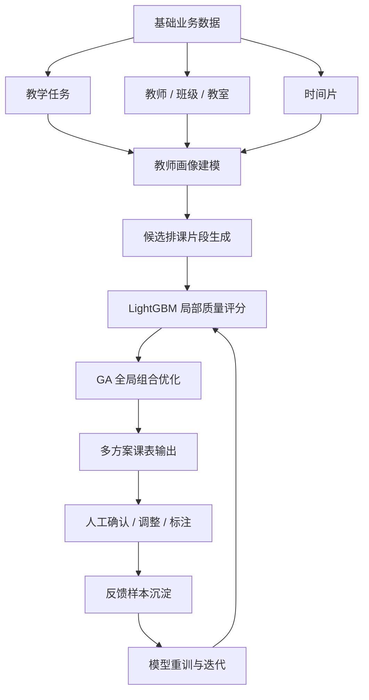
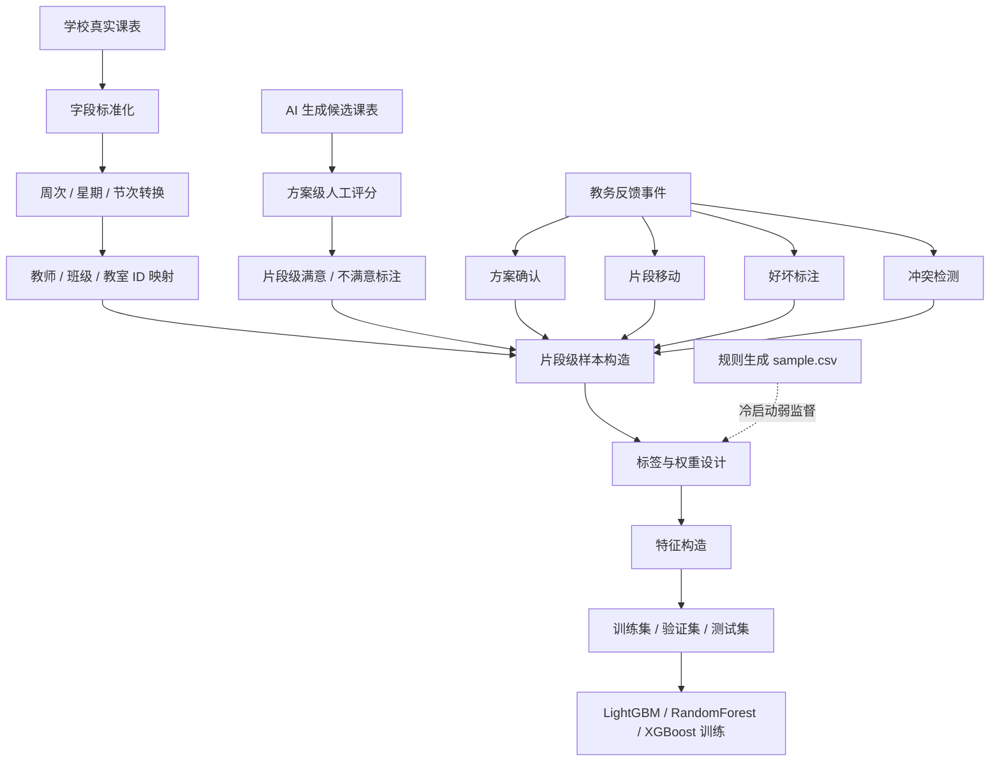
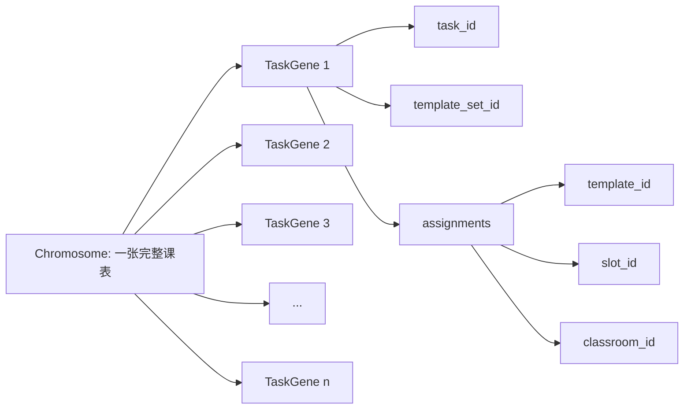
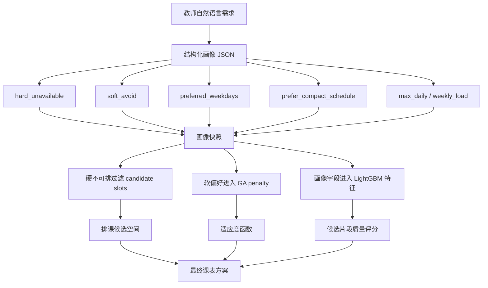
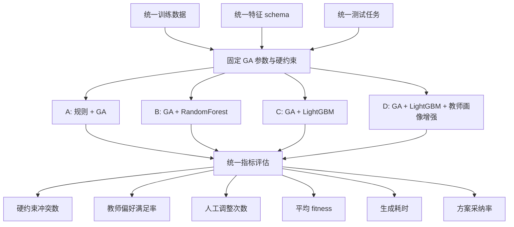

# 核心图 Mermaid 草稿

> 更新时间：2026-05-26
> 目标：将论文和答辩 PPT 中优先级最高的核心图转成 Mermaid 草稿，后续可直接导出为图片或改成 draw.io / PPT 图形。

## 1. 总体技术路线图

用途：论文第 3 章、PPT 第 4 页。  
作用：讲清楚项目从基础数据到反馈训练闭环的完整主线。



讲述口径：

```text
系统不是让大模型直接生成课表，而是先把业务数据和教师画像转为结构化约束与特征，再由 LightGBM 对候选片段评分，GA 负责完整课表组合优化，最后通过人工反馈沉淀训练样本。
```

## 2. 训练数据链路图

用途：论文第 4 章、PPT 第 7 页。  
作用：回答“训练样本从哪里来、为什么现有 sample.csv 不够”。



讲述口径：

```text
现有 sample.csv 只能作为规则冷启动数据，真正的训练数据应以学校真实课表为主，并辅以人工认可的 AI 生成课表和教务调整反馈。
```

## 3. LightGBM + GA 混合优化流程图

用途：论文第 5 章、PPT 第 9~11 页。  
作用：讲清楚模型和 GA 的分工。

```mermaid
flowchart TD
    A[教学任务] --> D[候选片段枚举]
    B[候选时间片] --> D
    C[候选教室] --> D

    D --> E[规则与教师画像 penalty]
    D --> F[LightGBM / RF / 规则评分器]

    E --> G[综合原始评分 raw_i]
    F --> G

    G --> H[q_i = sigmoid(raw_i / T)]
    H --> I[GA 初始种群构造]
    I --> J[选择]
    J --> K[交叉]
    K --> L[变异]
    L --> M[repair 修复硬冲突]
    M --> N[fitness 评价]
    N --> O{是否达到终止条件}
    O -- 否 --> J
    O -- 是 --> P[输出完整课表方案]
```

讲述口径：

```text
LightGBM 只回答某个候选片段质量如何，GA 负责把这些片段组合成完整课表；硬约束仍由规则检测和 repair 机制保证。
```

## 4. GA 染色体编码图

用途：论文第 5 章、PPT 第 10 页。  
作用：回答“GA 编码到底怎么设计”。



补充说明：

```text
一个染色体表示一张完整课表，一个基因表示一个教学任务的安排。周次由模板集约束，GA 主要优化模板集、时间槽和教室选择。
```

## 5. 教师画像作用路径图

用途：论文第 4 章、PPT 第 6 页。  
作用：强调教师画像不是文本备注，而是真正进入排课计算。



讲述口径：

```text
教师画像通过三条路径参与排课：硬不可排负责过滤候选，软偏好进入 GA 惩罚项，画像字段进入模型特征。
```

## 6. 消融实验设计图

用途：论文第 7 章、PPT 第 12 页。  
作用：说明如何证明模型和教师画像有效。



讲述口径：

```text
消融实验固定训练数据、特征 schema、测试任务和 GA 参数，只替换评分器或教师画像特征，观察最终业务指标变化。
```

## 后续处理建议

1. 论文中可以直接使用 Mermaid 导出 SVG / PNG。
2. PPT 中建议把 Mermaid 图重绘为更简洁的卡片式流程图。
3. 实验结果出来后，再补结果柱状图和对比表。
4. 系统页面稳定后，再补截图组合图。
